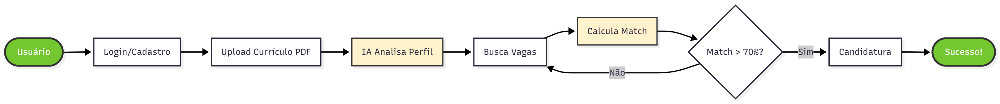
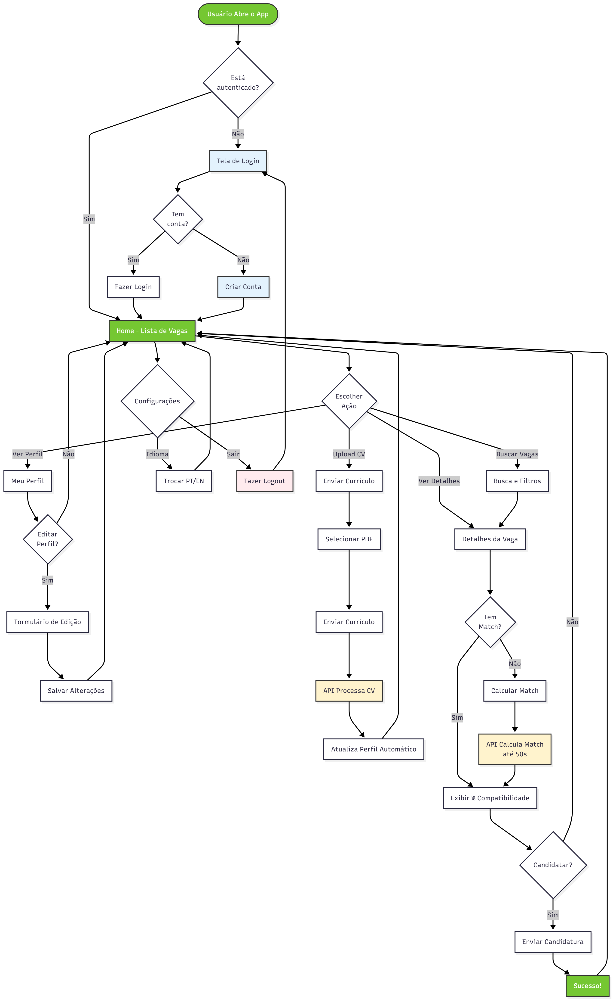
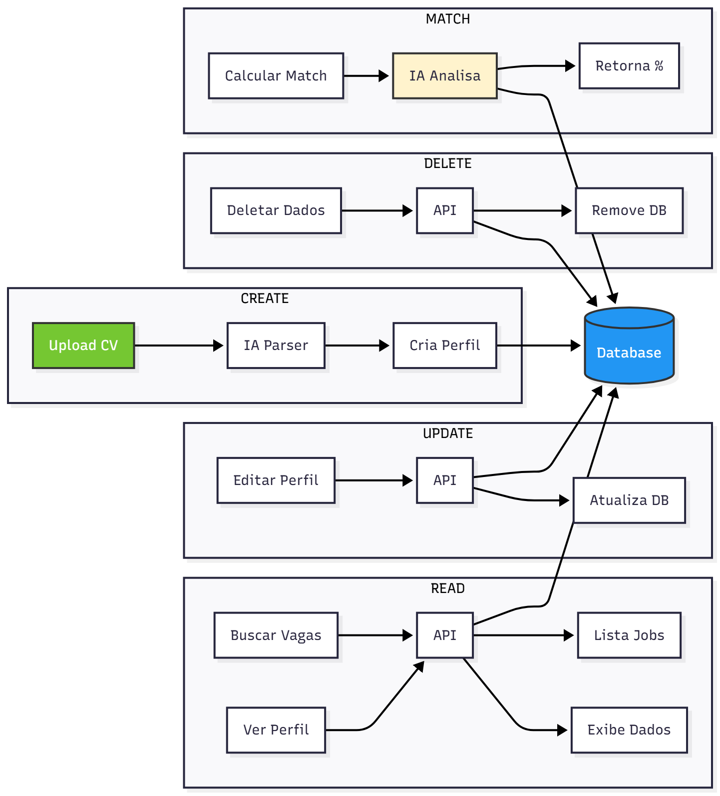
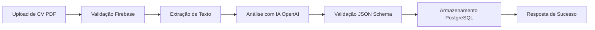

  

  

  # Global Solution - Sistema Inteligente de Match de Vagas

  

  **Análise automática de currículos com IA para encontrar as melhores oportunidades**

  

  
  

  

---

## 👥 Equipe

<table>
<tr>
<td width="50%">

| Nome | RM | GitHub |
|------|-------|--------|
| Marcos Vinicius Pereira de Oliveira | 557252 | [@marcos3777](https://github.com/marcos3777) |
| Ruan Lima Silva | 558775 | [@ruaanls](https://github.com/ruaanls) |
| Richardy Borges Santana | 557883 | [@RichardyBS](https://github.com/RichardyBS) |

</td>
<td width="50%">

  

</td>
</tr>
</table>

---

## 📄 Sobre o Projeto

Sistema automatizado de análise de currículos que utiliza **N8n** como backend de automação, integrado com **IA da OpenAI** (GPT-4.1-mini) para leitura e interpretação inteligente de currículos. O sistema realiza extração avançada de dados, match de perfil e vaga, sugerindo as melhores oportunidades para candidatos.

### Fluxo do Usuário

  

### Principais Funcionalidades

- 📄 **Upload e análise automática de currículos em PDF**
- 🤖 **Extração inteligente de mais de 40 campos do currículo**
- 🎯 **Análise de perfil comportamental e competências técnicas**
- 🔐 **Autenticação segura com Firebase**
- 💾 **Armazenamento estruturado em PostgreSQL**
- ✅ **Validação de dados com JSON Schema**

---

## 🛠️ Tecnologias

- **N8n** (Plataforma de automação de workflows)
- **OpenAI API** (GPT-4.1-mini)
- **PostgreSQL** (Banco de dados relacional)
- **Firebase Authentication** (Sistema de autenticação)
- **Webhooks** (APIs RESTful)
- **JSON Schema** (Validação de dados)

---

## 🏗️ Arquitetura do Sistema

### Fluxo Completo do Workflow

  

### Arquitetura de Componentes

  

### Componentes Principais

#### 1. 📥 Recepção de Dados
- **Webhook**: Endpoint POST `/leituracv` que recebe currículos via upload de arquivos PDF
- **On Form Submission**: Captura dados de formulários web para complementar informações

#### 2. 🤖 Processamento com IA
- **Extract from File**: Extrai texto de arquivos PDF enviados
- **AI Agent**: Processador inteligente que analisa o conteúdo do currículo
- **OpenAI Chat Model**: Utiliza GPT-4.1-mini para interpretação avançada
- **Structured Output Parser**: Valida e estrutura a saída em formato JSON padronizado

#### 3. 📊 Dados Extraídos do Currículo

**Dados Pessoais:**
- Nome, email, estado, cidade, idade
- Posição atual, empresa atual

**Experiência Profissional:**
- Histórico de empregos anteriores (empresa, cargo, período)
- Nível de senioridade
- Experiência em gestão

**Formação e Competências:**
- Nível de educação
- Cursos e certificações
- Habilidades técnicas com nível de proficiência
- Idiomas com nível de fluência
- Ferramentas e tecnologias

**Perfil Comportamental:**
- Personalidade e estilo de trabalho
- Estilo de liderança e comunicação
- Abordagem para resolução de problemas
- Motivações e objetivos de carreira

**Preferências de Trabalho:**
- Cargos desejados
- Tipo de emprego preferido (CLT, PJ, etc.)
- Salário desejado
- Preferência de ambiente (remoto/presencial/híbrido)
- Disponibilidade para viagem e realocação

**Dados Complementares:**
- LinkedIn, GitHub, portfólio
- Tags e palavras-chave
- Fuso horário

#### 4. 🔐 Autenticação e Segurança
- **Check Token Firebase**: Valida tokens de autenticação Firebase
- **Error Handlers**: Tratamento de erros para autenticação, arquivo e IA

#### 5. 💾 Armazenamento de Dados
- **PostgreSQL**: Banco de dados relacional para armazenar perfis de candidatos
- **Insert/Update Operations**: Insere novos perfis ou atualiza existentes (UPSERT)
- **Select Operations**: Recupera informações de candidatos pelo ID

#### 6. ✅ Resposta ao Usuário
- **Success Nodes**: Retorna confirmação de sucesso após processamento
- Resposta estruturada com dados processados em JSON

---

## 📋 Fluxo de Funcionamento

1. **Upload**: Candidato envia currículo em PDF através do webhook
2. **Autenticação**: Token Firebase é validado para segurança
3. **Extração**: Sistema extrai texto do arquivo PDF
4. **Análise IA**: OpenAI processa o currículo e extrai informações estruturadas
5. **Validação**: Output Parser garante que o JSON está no formato correto
6. **Armazenamento**: Dados são salvos ou atualizados no PostgreSQL
7. **Resposta**: Sistema retorna confirmação de sucesso com dados processados

---

  

  

  **Projeto desenvolvido para Global Solution - FIAP 2025**

  

  © 2025 Conveni Team - Todos os direitos reservados

